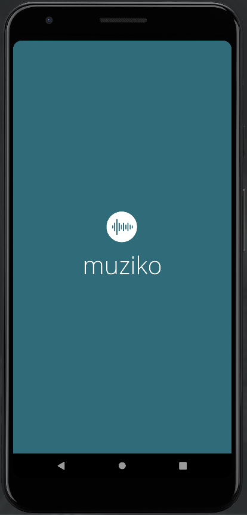
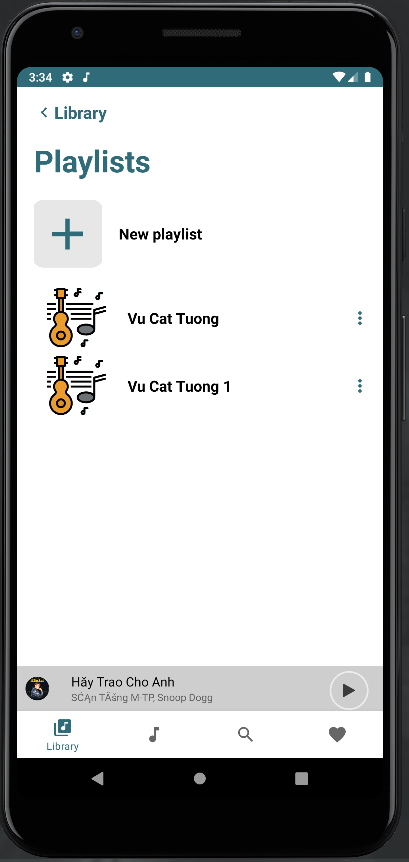
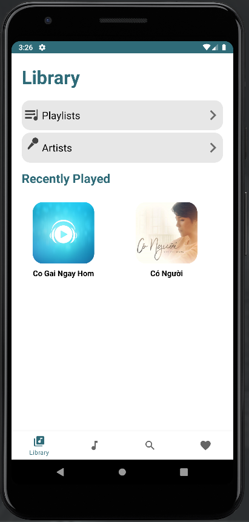
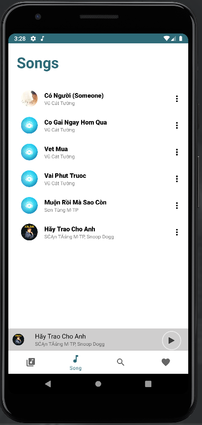
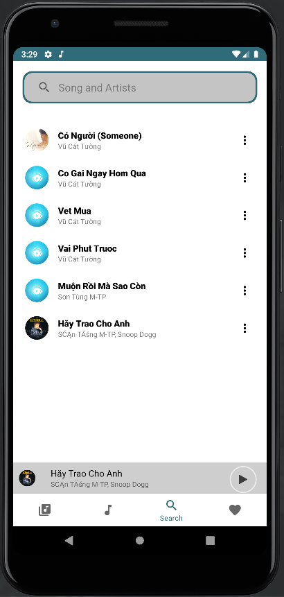
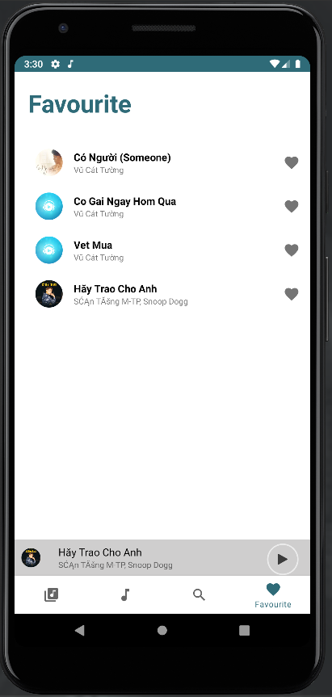

# Muziko
Muziko is a simple and small music player, with features such as creating playlists, adding music to favorites, searching music, controlling music through notifications, and more.

## Mockup
[Mockup App](https://www.figma.com/file/Cr9TsJU3NlgkgrNeQCaorX/Muziko?node-id=0%3A1)

## 📷 Screenshots 
 |  |  |  
|:---:|:---:|:---:|:---:|
|Muziko Screen | Playlists | Add Song To Playlist | Player Panel

|  |  |  |  
|:---:|:---:|:---:|:---:|
| Library | Song | Search | Favorites|
